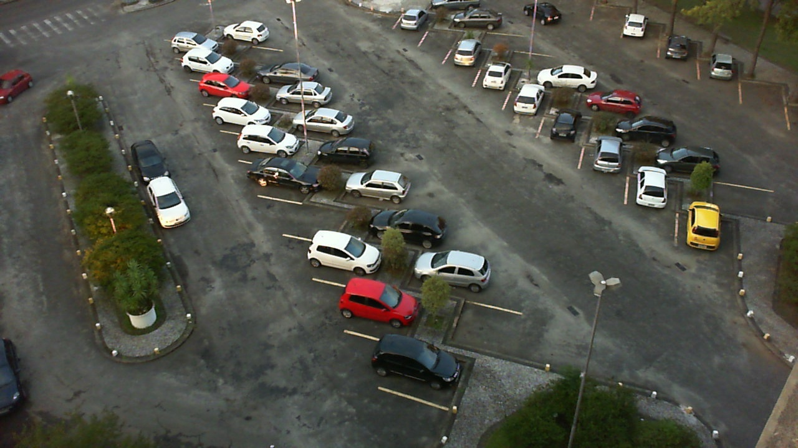
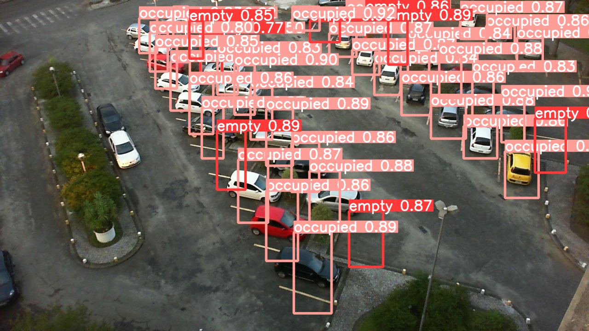

# Parking Lot Prediction

## Introduction

This project makes it able to predict the number of available parking lots in a parking lot. The model used is yolov8 and fine-tuned on the parking lot dataset. The dataset is collected from [Kaggle](https://www.kaggle.com/datasets/blanderbuss/parking-lot-dataset). The dataset contains over 695,899 images.

## Usage

### 1. Clone the repository

```bash
git clone https://github.com/Detopall/parking-lot-prediction.git
```

### 2. Install requirements

```bash
pipenv install
pipenv shell
```

If you want to train this model yourself, you'll need to download the dataset and move the zip folder to the ``data`` folder. Then, you'll just need to run all the cells inside the ``main.ipynb`` notebook.

## Additional information

In the folder: ``runs/detect/train`` you can find the weights, best and last model, confusions matrix, and the results of the model ...

## Results

The model was trained for 2 epochs (on cpu => 8h to train) and the results are shown below:




